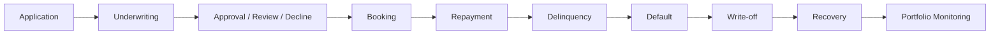

# Credit Lifecycle Map

This document maps the lending lifecycle to the risk question, metric and decision use in Project 3.

| lifecycle_stage | risk_question | data_available | metric | decision_use |
| --- | --- | --- | --- | --- |
| Application | Is the applicant creditworthy? | Application features, reject population profile | Application count, missing income, FICO/DTI | Approve, review or decline |
| Underwriting | Is the data reliable and eligible? | Feature eligibility and leakage checks | Missing flags, leakage flag, eligibility status | Request documents or route to review |
| Booking | What exposure is created? | Accepted/booked loan amount | EAD proxy, loan amount, product type | Set limit and exposure controls |
| Repayment | Is performance developing as expected? | Matured booked accounts | Good/bad status after performance window | Monitor portfolio health |
| Delinquency | Is early arrears risk increasing? | No monthly DPD in core consumer data | Framework only: 30/60/90 DPD rates | Early warning and collection routing |
| Default | When is the account bad? | Default/bad flag on matured accounts | Default rate, PD, bad count | Model target and validation outcome |
| Write-off | What loss is recognized? | SBA charge-off reference, proxy consumer LGD | Charge-off profile, LGD proxy | Loss and provision bridge |
| Recovery | How much can be collected after default? | No consumer recovery cashflows | Framework only: recovery rate, workout LGD | Collection strategy and LGD limitation |
| Monitoring | Is the model/portfolio still stable? | Monthly monitoring base and score bands | PSI, vintage bad rate, calibration gap | Review, recalibrate or tighten policy |